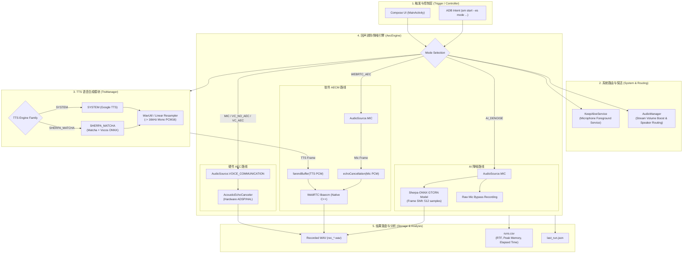
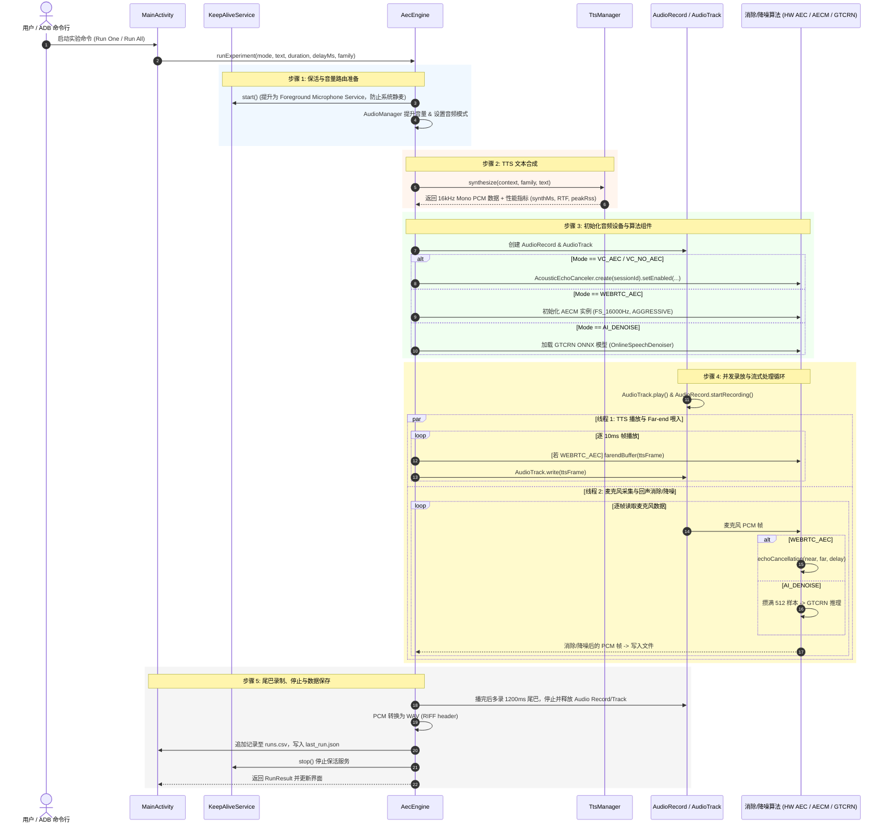

# AecTtsDemo 项目架构与代码流程说明

本项目是一个 Android 端 **TTS 播放与麦克风录音回声消除（AEC）及 AI 降噪对照实验 Demo**。
主要用于验证在外放 TTS 语音的同时启动麦克风录音时，系统硬件 AEC、软件 WebRTC AECM 以及 Sherpa-ONNX AI 人声降噪（GTCRN）的表现与差异。

---

## 一、 核心架构与模块说明

| 模块 / 类 | 核心功能与职责 |
| :--- | :--- |
| **[MainActivity.kt](file:///home/wangyl/work/code/android/demo/TTS-test-demo/app/src/main/java/dev/wangyl/aecttsdemo/MainActivity.kt)** | **UI 交互与 ADB 自动化入口** • 使用 Jetpack Compose 提供交互界面，支持切换模式、TTS 引擎、音量/延迟调节。 • 模式选择下方「录音试听」行：存在 `aec_runs/rec_<mode>.wav` 时显示播放按钮（播放/停止切换；实验期间禁用并自动停止，防止播放声串入录音），AI_DENOISE 额外提供原始麦克风旁路录音对照。 • 支持通过 `am start --es mode ...` 进行无干预命令行测试。 • 负责将每次测试结果追加落盘到 `runs.csv` 和 `last_run.json`。 |
| **[AecEngine.kt](file:///home/wangyl/work/code/android/demo/TTS-test-demo/app/src/main/java/dev/wangyl/aecttsdemo/AecEngine.kt)** | **实验控制与音频流水线引擎** • 统一调度音频路由、音量提升、并发录放、回声/降噪算法处理与 PCM/WAV 格式转换。 • 实现了 5 种回声消除/降噪模式的采集与处理流水线。 |
| **[TtsManager.kt](file:///home/wangyl/work/code/android/demo/TTS-test-demo/app/src/main/java/dev/wangyl/aecttsdemo/TtsManager.kt)** | **TTS 语音合成统一抽象** • 统一输出 `16kHz mono PCM16`。 • 支持 `SYSTEM`（系统原生 Google TTS）与 `SHERPA_MATCHA`（本地 Sherpa-ONNX + Matcha 声学模型 + Vocos 声码器）。 • 采集合成耗时 (synthMs)、音频时长 (audioMs)、实时因子 (RTF) 与内存峰值 (peakRssMB)。 |
| **[KeepAliveService.kt](file:///home/wangyl/work/code/android/demo/TTS-test-demo/app/src/main/java/dev/wangyl/aecttsdemo/KeepAliveService.kt)** | **麦克风前台保活服务** • 挂载为 `MICROPHONE` 类型的前台服务，专门应对 ColorOS/Android 隐私管控（非前台 app 使用麦克风 1s 后被系统强制静音的问题）。 |
| **WavUtil** | **音频格式处理工具** • 提供 WAV 文件解析、多声道下采样/混单以及线性重采样（如从 48kHz/22.05kHz 转换至 16kHz）。 |
| **analyze_aec.py** | **离线对比分析脚本** • 提取录音 WAV 的 RMS 能量、计算回声残留率，并绘制语谱图对比。 |

---

## 二、 五种回声消除/降噪模式对比

| 模式 | 音源 (`AudioSource`) | 处理方案 | 参考信号 (Far-end) | 特点与实测表现 |
| :--- | :--- | :--- | :--- | :--- |
| **`MIC`** | `MIC` | **无处理（基线）** | 无 | 录音中保留完整清晰的 TTS 回声。 |
| **`VC_NO_AEC`** | `VOICE_COMMUNICATION` | 硬件 AEC 显式禁用 (`enabled=false`) | 系统内部 | 用于验证厂商 HAL 是否强制开启 AEC（ColorOS 上硬件 AEC 依然常开）。 |
| **`VC_AEC`** | `VOICE_COMMUNICATION` | **硬件 `AcousticEchoCanceler` 开启** | 系统内部 | 依赖系统底模，消除最干净（残留率接近 0%）。 |
| **`WEBRTC_AEC`** | `MIC` | **软件 WebRTC AECM (`libaecm`)** | **应用显式提供** (`farendBuffer`) | 跨平台可控；将即将播放的 TTS 帧喂给 AECM 充当参考信号，在近端信号中消去回声。 |
| **`AI_DENOISE`** | `MIC` | **Sherpa-ONNX GTCRN 人声降噪** | 不需要（盲分离） | 基于深度学习的无参考盲降噪，对稳态噪声有效；但对同为人声的 TTS 语音不做消除（保持 TTS 完整度）。 |

---

## 三、 TTS 引擎对比（OnePlus 9 实测）

| 指标 | SYSTEM (Google TTS) | SHERPA_MATCHA (本地 Matcha+Vocos) |
| :--- | :--- | :--- |
| **合成耗时** | ~3263 ms | ~2014 ms（首次需 3.1s 模型加载） |
| **RTF** | **0.35** | **0.25** (Snapdragon 888 8线程) |
| **进程峰值内存** | ~29 MB（独立进程合成） | **~207 MB** (ONNX Runtime + 模型加载进进程) |
| **模型体积** | 0（系统组件） | 139 MB assets (Matcha + Vocos + Dict/FST) |

---

## 四、 核心架构流程图与时序图

### 1. 整体架构与数据流图 (Flowchart)

---

### 2. 实验完整执行时序图 (Sequence Diagram)

---

## 五、 设备适配难点与关键优化

1. **ColorOS 后台静麦规避**：
   - 非前台 app 使用麦克风 1s 后会触发系统静音，通过前台服务 `KeepAliveService` (`FOREGROUND_SERVICE_TYPE_MICROPHONE`) 与 `keepScreenOn` 配合解决。
2. **独立通话音量控制**：
   - 通话音源 `VOICE_COMMUNICATION` 使用 `STREAM_VOICE_CALL` 通道，音量独立于媒体音量。应用内实现自动提满与恢复逻辑，避免静音播放导致实验失效。
3. **Matcha 韵律与调参**：
   - 调整 `noiseScale` 为 0.45、`silenceScale` 为 0.6，平抑句间音高漂移并修复句末断句过硬问题。

